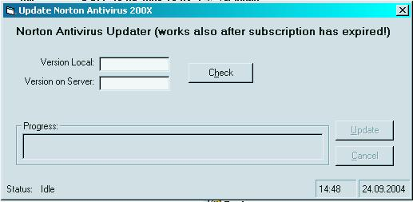



## Norton Antivirus Updater \(Update 1\)

### Description

This little programm allows you to download the latest virus definitions from Symantec to update your Norton Antivirus 200X. You are also able to update your virus definitions if your subscription has already expired!

UPDATE: Modified the prog to work again after Symantec changed the download server.
 
### More Info
 
Was only tested with Norton Antivirus 2003, but should work with all newer versions. Please tell me if it works with other versions too.

             |
---                |---
**Submitted On**   |2004-09-27 11:18:36
**By**             |[theint](https://github.com/Planet-Source-Code/PSCIndex/blob/master/ByAuthor/theint.md)
**Level**          |Beginner
**User Rating**    |4.3 (17 globes from 4 users)
**Compatibility**  |VB 4\.0 \(32\-bit\), VB 5\.0, VB 6\.0
**Category**       |[Internet/ HTML](https://github.com/Planet-Source-Code/PSCIndex/blob/master/ByCategory/internet-html__1-34.md)
**World**          |[Visual Basic](https://github.com/Planet-Source-Code/PSCIndex/blob/master/ByWorld/visual-basic.md)
**Archive File**   |[Norton\_Ant18070610182004\.zip](https://github.com/Planet-Source-Code/theint-norton-antivirus-updater-update-1__1-56334/archive/master.zip)

